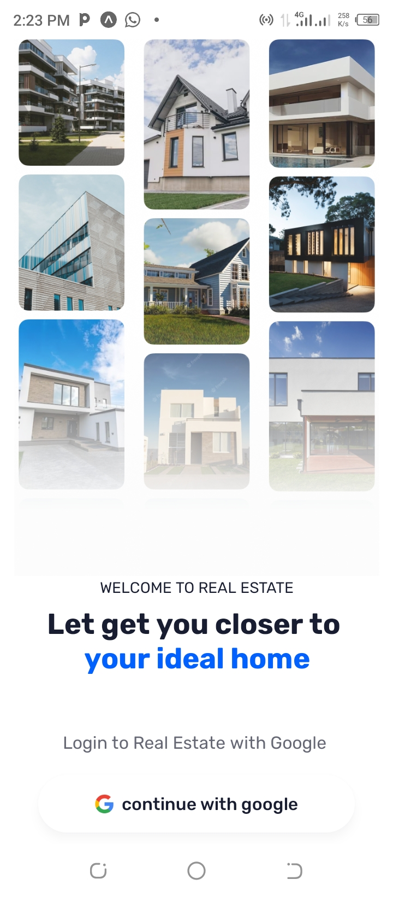
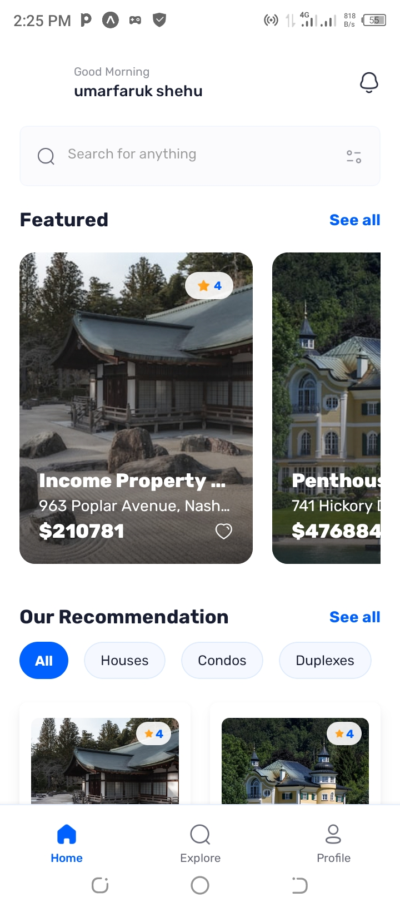

# 🏡 Real Estate App

A modern, feature-rich mobile real estate application built with React Native and Expo. Browse properties, connect with agents, and find your dream home - all from your mobile device.


## ✨ Features

- 🏠 **Property Listings** - Browse 20+ real estate properties with detailed information
- 🔍 **Smart Search** - Search properties by name, location, or type with real-time filtering
- 🏷️ **Property Filters** - Filter by property type (House, Condo, Villa, Apartment, etc.)
- 🤝 **Agent Profiles** - View agent information and contact details for each property
- ⭐ **Reviews & Ratings** - Read authentic reviews from previous buyers
- 📸 **Image Galleries** - Browse multiple high-quality images for each property
- 🗺️ **Location Maps** - View property locations with integrated maps
- 🏢 **Property Details** - Comprehensive information including bedrooms, bathrooms, area, price
- 🔐 **Google OAuth** - Secure authentication with Google Sign-In
- 💾 **Real-time Database** - Powered by Appwrite for fast, reliable data sync
- 🎨 **Modern UI/UX** - Beautiful, intuitive interface with smooth animations
- 📱 **Responsive Design** - Optimized for all mobile screen sizes

## 📱 Screenshots

<div align="center">

### Authentication & Home
  

### Property Details & Search
 

### Explore & Profile
 

</div>

## 🛠️ Tech Stack

### Frontend
- **React Native** - Cross-platform mobile development
- **Expo** - Development and build tooling (SDK 54)
- **TypeScript** - Type-safe code with full type coverage
- **NativeWind v4** - Tailwind CSS for React Native
- **Expo Router v6** - File-based navigation system

### Backend & Services
- **Appwrite** - Backend-as-a-Service (BaaS)
  - Authentication (Google OAuth 2.0)
  - Database (Collections & Documents)
  - Storage (Image hosting)
  - Real-time updates
- **React Native Appwrite SDK** - Native Appwrite integration

### State Management & Data
- **Custom Hooks** - React hooks for data fetching (`useAppwrite`)
- **Context API** - Global state management
- **AsyncStorage** - Local data persistence

### UI & Styling
- **Custom Fonts** - Rubik font family (Regular, Medium, Bold, ExtraBold)
- **Expo Vector Icons** - Comprehensive icon library
- **Expo Image** - Optimized image loading
- **React Native Safe Area Context** - Safe area handling

### Development Tools
- **ESLint** - Code linting with Expo config
- **Prettier** - Code formatting with Tailwind plugin
- **TypeScript** - Static type checking

## 🚀 Getting Started

### Prerequisites

- Node.js 18+ installed
- npm or yarn package manager
- Expo CLI (`npm install -g expo-cli`)
- iOS Simulator (Mac) or Android Studio (for emulator)
- Appwrite account ([Sign up here](https://cloud.appwrite.io/))

### Installation

1. **Clone the repository**
```bash
git clone https://github.com/Ushehu/realestate-app.git
cd realestate-app
```

2. **Install dependencies**
```bash
npm install
```

3. **Create environment file**

Create a `.env.local` file in the root directory:

```env
# Appwrite Configuration
EXPO_PUBLIC_APPWRITE_ENDPOINT=https://cloud.appwrite.io/v1
EXPO_PUBLIC_APPWRITE_PROJECT_ID=your_project_id
EXPO_PUBLIC_APPWRITE_DATABASE_ID=your_database_id

# Collection IDs
EXPO_PUBLIC_APPWRITE_PROPERTIES_TABLE_ID=properties
EXPO_PUBLIC_APPWRITE_AGENTS_TABLE_ID=agents
EXPO_PUBLIC_APPWRITE_REVIEWS_TABLE_ID=reviews
EXPO_PUBLIC_APPWRITE_GALLERIES_TABLE_ID=galleries

# Storage
EXPO_PUBLIC_APPWRITE_BUCKET_ID=your_bucket_id
```

4. **Set up Appwrite Backend**

Create these collections in your Appwrite database:

**Properties Collection:**
- name (string)
- type (enum: House, Townhouse, Condo, Duplex, Studio, Apartment, Villa, Others)
- description (string, 5000 chars)
- address (string)
- geolocation (string)
- price (integer)
- area (integer)
- bedrooms (integer)
- bathrooms (integer)
- rating (integer)
- facilities (string[], array)
- image (string, URL)
- agent (relationship to Agents)
- reviews (relationship to Reviews, array)
- gallery (relationship to Galleries, array)

**Agents Collection:**
- name (string)
- email (string)
- avatar (string, URL)

**Reviews Collection:**
- name (string)
- avatar (string, URL)
- review (string, 1000 chars)
- rating (integer)

**Galleries Collection:**
- image (string, URL)

5. **Configure Google OAuth**

In Appwrite Console:
- Go to Auth → Settings
- Enable Google OAuth
- Add your OAuth credentials

6. **Seed the database** (Optional)

If you want sample data, use the provided seed script:
```bash
# Sign in to the app first, then use the seed function
# in development mode through the Profile screen
```

7. **Start the development server**
```bash
npx expo start
```

8. **Run on device/emulator**
- Press `i` for iOS simulator
- Press `a` for Android emulator
- Scan QR code with Expo Go app for physical device

## 📁 Project Structure

```
realestate/
├── app/                          # App screens (Expo Router)
│   ├── (auth)/                  # Authentication flow
│   │   └── sign-in.tsx          # Google Sign-In screen
│   ├── (root)/                  # Main app (after auth)
│   │   ├── (tabs)/              # Bottom tab navigation
│   │   │   ├── index.tsx        # Home screen
│   │   │   ├── explore.tsx      # Explore properties
│   │   │   └── profile.tsx      # User profile
│   │   ├── properties/          # Property details
│   │   │   └── [id].tsx         # Dynamic property page
│   │   └── _layout.tsx          # Root layout
│   ├── _layout.tsx              # App layout
│   └── globals.css              # Global styles
├── components/                   # Reusable components
│   ├── Cards.tsx                # Property cards
│   ├── Comment.tsx              # Review component
│   ├── Filters.tsx              # Filter chips
│   ├── NoResults.tsx            # Empty state
│   └── Search.tsx               # Search bar
├── lib/                         # Core functionality
│   ├── appwrite.ts              # Appwrite client & API
│   ├── types.ts                 # TypeScript types
│   ├── useAppwrite.ts           # Data fetching hook
│   ├── global-provider.tsx      # Global state provider
│   ├── seed.ts                  # Database seeding
│   └── data.ts                  # Static data (images)
├── constants/                   # App constants
│   ├── icons.ts                 # Icon exports
│   ├── images.ts                # Image exports
│   └── data.ts                  # Static data
├── assets/                      # Static assets
│   ├── fonts/                   # Custom fonts
│   ├── icons/                   # App icons
│   └── images/                  # App images
├── .env.local                   # Environment variables
├── tailwind.config.js           # Tailwind configuration
├── tsconfig.json                # TypeScript configuration
└── package.json                 # Dependencies
```

## 🎯 Key Features Explained

### Google OAuth Authentication
Seamless sign-in experience using Google OAuth 2.0 through Appwrite. Users can authenticate with their Google accounts without creating new credentials.

### Real-time Property Search
Smart search functionality with debouncing that searches across property names, addresses, and types. Results update in real-time as users type.

### Dynamic Property Filtering
Filter properties by type using interactive filter chips. Filters work in combination with search for precise results.

### Property Details Page
Comprehensive property information including:
- High-resolution hero image
- Property specifications (beds, baths, area)
- Agent contact information
- Full description
- Facilities list with icons
- Image gallery
- Location map
- User reviews and ratings
- Pricing information

### Custom Data Fetching Hook
The `useAppwrite` hook provides:
- TypeScript generics for type safety
- Loading and error states
- Automatic data refetching
- Reusable across all screens

### Database Seeding
Automated seeding script generates:
- 20 realistic properties
- 5 professional agents
- 20 authentic reviews
- 10 gallery images
- Proper relationships between collections

## 🎨 Design Patterns

### Component Architecture
- **Atomic Design**: Small, reusable components
- **Props Interface**: Strict TypeScript typing
- **Composition**: Components composed from smaller pieces

### State Management
- **Context API**: Global authentication state
- **Custom Hooks**: Encapsulated data fetching logic
- **Local State**: Component-level state with useState

### Type Safety
- **Interface Definitions**: All data structures typed
- **Generic Hooks**: Type-safe data fetching
- **Strict Mode**: No implicit any types

### Performance Optimizations
- **Lazy Loading**: Images loaded on demand
- **Debounced Search**: Reduced API calls
- **Memoization**: React.memo for expensive components
- **Parallel API Calls**: Promise.all for batch operations

## 🔧 Configuration

### Customize Theme Colors

Edit `tailwind.config.js`:

```javascript
theme: {
  extend: {
    colors: {
      primary: {
        100: "#E5E7EB", // Light
        200: "#D1D5DB", 
        300: "#0061FF", // Main brand color
      },
      // Add your brand colors
    }
  }
}
```

### Add New Property Types

Edit `lib/seed.ts`:

```typescript
const propertyTypes = [
  { type: "Your Type", priceRange: [min, max] },
  // Add more types
];
```

### Modify Search Behavior

Edit `lib/appwrite.ts`:

```typescript
Query.or([
  Query.search("name", query),
  Query.search("address", query),
  Query.search("type", query),
  // Add more searchable fields
])
```

## 🧪 Testing

```bash
# Type checking
npx tsc --noEmit

# Linting
npm run lint

# Format code
npm run format
```

## 📦 Building for Production

### Development Build (with native features)
```bash
# Build for iOS
eas build --profile development --platform ios

# Build for Android
eas build --profile development --platform android
```

### Production Build
```bash
# Configure EAS (first time only)
eas build:configure

# Build for iOS
eas build --platform ios

# Build for Android  
eas build --platform android
```

## 🚢 Deployment

### iOS App Store
1. Build production app: `eas build --platform ios`
2. Submit to App Store: `eas submit --platform ios`
3. Follow App Store Connect review process

### Google Play Store
1. Build production app: `eas build --platform android`
2. Submit to Play Store: `eas submit --platform android`
3. Follow Google Play Console review process

## 🎓 What I Learned

Building this real estate app taught me:

- **Modern Mobile Development**: React Native and Expo for cross-platform apps
- **Backend Integration**: Working with Appwrite BaaS for authentication and data
- **TypeScript**: Type-safe development with interfaces and generics
- **State Management**: Context API and custom hooks for global state
- **OAuth Implementation**: Google Sign-In integration
- **Database Design**: Relational data with collections and relationships
- **Performance**: Optimizing API calls and implementing lazy loading
- **UI/UX Design**: Creating intuitive navigation and user flows
- **Error Handling**: Graceful error states and loading indicators

## 🚀 Technical Highlights

### Advanced TypeScript Usage
```typescript
// Generic data fetching hook with type inference
export const useAppwrite = <T, P extends Record<string, any> = any>({
  fn,
  params,
  skip,
}: UseAppwriteOptions<T, P>): UseAppwriteReturn<T, P> => {
  // Implementation with full type safety
}
```

### Parallel Data Operations
```typescript
// Efficient batch operations with Promise.all
const propertyPromises = Array.from({ length: 20 }, (_, i) => 
  databases.createDocument(...)
);
await Promise.all(propertyPromises);
```

### Type-Safe API Layer
```typescript
// Strongly typed API functions
export async function getPropertyById({ 
  id 
}: { 
  id: string 
}): Promise<Property | null> {
  // Type-safe implementation
}
```

## 🤝 Contributing

Contributions are welcome! Please follow these steps:

1. Fork the repository
2. Create a feature branch (`git checkout -b feature/AmazingFeature`)
3. Commit your changes (`git commit -m 'Add some AmazingFeature'`)
4. Push to the branch (`git push origin feature/AmazingFeature`)
5. Open a Pull Request

### Contribution Guidelines

- Follow the existing code style
- Write meaningful commit messages
- Maintain TypeScript type safety
- Update documentation as needed
- Test on both iOS and Android

## 📝 License

This project is licensed under the MIT License - see the [LICENSE](LICENSE) file for details.

## 👨‍💻 Author

**Umar Faruk Shehu**
- GitHub: [@Ushehu](https://github.com/Ushehu)
- Email: ushehu132@gmail.com
- LinkedIn: [Umar Faruk Shehu](https://linkedin.com/in/umar-faruk-shehu)

## 🙏 Acknowledgments

- [Appwrite](https://appwrite.io/) - For excellent backend services
- [Expo](https://expo.dev/) - For amazing developer experience
- [React Native](https://reactnative.dev/) - For cross-platform development
- [Unsplash](https://unsplash.com/) - For beautiful property images

## 📞 Support

If you have any questions or need help:

1. Check the [Issues](https://github.com/Ushehu/realestate-app/issues) page
2. Create a new issue with detailed information
3. Reach out via email: ushehu132@gmail.com

## 🗺️ Roadmap

- [x] Property listings and search
- [x] Google OAuth authentication  
- [x] Property details with gallery
- [x] Agent profiles
- [x] Reviews and ratings
- [x] Real-time filtering
- [ ] Favorites/Wishlist
- [ ] Property comparison
- [ ] Mortgage calculator
- [ ] Virtual tours (360° images)
- [ ] In-app messaging with agents
- [ ] Push notifications
- [ ] Dark mode
- [ ] Multi-language support
- [ ] Property sharing
- [ ] Advanced filters (price range, etc.)
- [ ] Map view of all properties
- [ ] Save search criteria
- [ ] Recent searches

## ⭐ Show your support

Give a ⭐️ if this project helped you learn something new!

---

<div align="center">
  <sub>Built with ❤️ by Umar Faruk Shehu</sub>
</div>